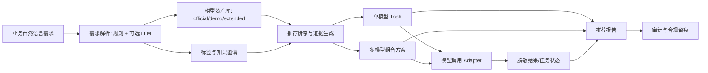

# 答辩提纲与问答

## 一句话定位

这是一个面向银行模型市场的智能推荐助手：把业务人员的自然语言需求，转成可追溯的模型推荐、组合方案、数据缺口、合规边界和报告。

## 核心创新点

1. 自然语言到模型语言的结构化解析。
2. 官方模型资产库和 demo 模型资产库统一管理，并用 `source` 区分来源。
3. TopK 推荐不仅给模型名，还给评分拆解、证据卡片、数据缺口和适用边界。
4. 多模型组合方案支持 IO 兼容性和脱敏执行结果。
5. LLM 作为可配置增强层，负责复杂理解、解释、合成数据和 Judge，但不替代本地确定性校验。
6. 权限、审计、合规提示和脱敏结果贯穿推荐到报告。
7. 官方指标、鲁棒集、API smoke、Docker smoke 都有可复现证据。

## 指标证据

最近官方评估：

| 指标 | 当前值 | 目标 |
|---|---:|---:|
| 意图识别准确率 | 97.12% | >= 93% |
| 标签转换准确率 | 99.04% | >= 90% |
| Top3 命中率 | 93.53% | >= 85% |
| Top5 命中率 | 97.12% | >= 92% |
| 组合适配度 | 83.5 | >= 80 |

其他证据：

- 后端测试：379 passed，1 warning。
- API smoke：5/5。
- Docker HTTP smoke：5/5。
- 鲁棒扰动集：Intent 96.74%，Top3 94.48%，Top5 98.61%。
- 密钥扫描：未发现疑似泄漏。
- 主指标关闭LLM和定向关键词规则；真实Qwen测试拆分Top3/Top5为91.94%/96.77%，62/62条有trace，各净增3条且0退化，无非法或缺失模型ID。

## 系统架构

## 评委可能问题

### 1. 你们真的接入大模型了吗？

客观回答：

> 系统已经实现 BigModel/OpenAI-compatible Chat Completions 客户端。本地通过安全注入的 Qwen3.5-122B-A10B 完成了真实需求解析和62条测试拆分受约束重排，报告含62/62条 trace；密钥不进入仓库。部署环境未注入 key 时，系统明确返回 `llm_enabled=false` 或 SKIP，不伪造 live 调用结果。

补充证据：

- `backend/app/services/llm_client.py`
- `.env.example`
- `scripts/smoke_llm_demand_parser.py`
- `scripts/generate_synthetic_with_llm.py`
- `scripts/run_explanation_judge_with_llm.py`

### 2. 模型市场 API 是真的吗？

客观回答：

> 当前没有赛题方或银行提供的真实模型市场 API，因此不能宣称已接生产 API。我们实现了 adapter 架构：demo adapter 用脱敏结果演示，real/http adapter 支持接入真实上游；real 未配置时返回明确 503，不会静默返回 mock。

### 3. 指标是不是硬编码刷出来的？

客观回答：

> 指标由 `scripts/run_official_eval.py --all` 基于官方 417 问题和 60 模型重新计算。推荐引擎加载官方模型资产库，返回真实模型 ID。我们还保留了鲁棒扰动集，避免只看官方样本。

### 4. 为什么还需要规则，本项目不是大模型驱动吗？

客观回答：

> 银行场景不能把模型 ID、权限、合规和评估完全交给大模型。大模型适合理解和表达，本地规则和资产库负责确定性校验、模型存在性、权限、审计、指标计算和可追溯证据。这是混合架构，不是纯 prompt demo。

### 5. 如果接入真实银行数据，需要改什么？

回答：

> 第一，配置 real/http 模型市场 adapter；第二，导入真实模型资产和字段字典；第三，配置真实用户、角色、机构权限；第四，开启审计日志落库；第五，基于真实 API 返回补齐结果 schema 和脱敏策略。现有接口边界已经为这些步骤预留。

### 6. 合成数据能不能用于比赛指标？

回答：

> 不能。合成数据只用于开发、鲁棒性、UI 和训练候选，不用于官方指标报告。README 和数据卡明确区分 official、synthetic、synthetic_llm dry-run。

### 7. 你们系统的最大短板是什么？

回答：

> 赛题方没有提供真实银行模型市场 API，因此生产调用只能证明可接入架构，不能证明已经联调。当前更需要补齐的外部证据有两项：独立成员编写并复核的盲测集，以及真实业务人员填写的标准化理解度问卷。问卷采集、去重、统计和导出系统已经完成，但没有真人答卷前绝不声明该指标正式达标。

### 8. 业务人员理解度达到 90% 了吗？

客观回答：

> 目前不能正式声明达到。我们已经把 Q1-Q8 标准化问卷接到真实推荐页面，并实现一次性邀请码、每人至少两个样例、重复拦截、分角色/分场景统计和匿名导出。浏览器自动验收使用独立的 `acceptance_test` 模式，其数据永远不计入真人指标。下一步只需要组织真实业务、风控、产品、运营、合规和科技人员填写，并附可核验记录，系统即可生成正式统计。

### 9. 为什么具备国赛竞争力？

回答：

> 客观说，系统已经达到指标、工程和演示三条线同时可验证：官方指标达标，API/Docker 可运行，权限审计和合规边界明确。是否达到国一取决于评审对真实 API 接入、业务完整性和现场演示稳定性的权重。我们不承诺奖项，但这套系统已经具备冲高的基础。

## 现场演示失败应对

| 情况 | 处理 |
|---|---|
| 前端 3000 端口占用 | 使用 `FRONTEND_PORT=3001` 或 Vite `5173` |
| LLM 不可用 | 明确说明无 key，展示规则 fallback 和 SKIP 报告 |
| Docker 启动慢 | 先展示 `reports/smoke_api_docker_results.json`，再后台继续启动 |
| 浏览器页面卡住 | 使用 `python scripts\smoke_api.py` 证明后端链路 |
| 评委质疑 mock | 打开报告/结果中的 `demo_data`、合规提示和 README 边界说明 |

## 收尾话术

> 我们没有把 demo 包装成生产，也没有把 LLM 当成不可解释黑箱。系统的核心是把模型资产、规则校验、大模型理解、知识图谱证据、权限审计和合规边界整合起来。它现在可以稳定演示，指标达标；接入真实模型市场 API 后，就是一个可以进入联调的银行模型推荐工作台。
